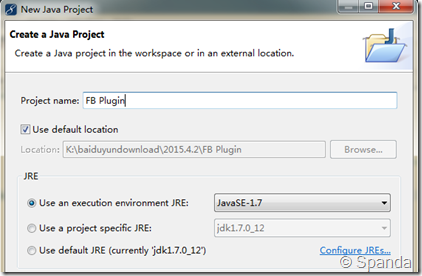

title: 从定义最简单Findbugs Detector做起
date: 2015-05-11 01:40:55
categories:
- 学习总结
tags:
- findbugs
- plugin
---

### 创建Eclipse项目

在eclipse中新建一个Java项目，使用jdk 1.7，从版本3.0开始Findbugs要求Java 7。项目名称符合Java项目名即可，这里以FB Plugin为例。


<!-- more -->

### 设置CLASSPATH

为了开发一个detector，我们需要对FindBugs的detector进行扩展，这里要使用到FindBugs的一些jar包。下载最新版本的FindBugs，在lib目录下找到findbugs.jar, bcel.jar，并将其添加到项目FB Plugin 的Build Path中。


### 编写BUG Detector
这里介绍一个FindBugs的例子（DMI_BIGDECIMAL_CONSTRUCTED_FROM_DOUBLE），用来检测BigDecimal实例使用Double进行构造。
> BigDecimal a = new BigDecimal(0.1);

实际a值为：0.1000000000000000055511151231257827021181583404541015625。

具体代码如下：

```java
package com.cqu.edu.test;

import java.math.BigDecimal;

import edu.umd.cs.findbugs.BugInstance;
import edu.umd.cs.findbugs.BugReporter;
import edu.umd.cs.findbugs.OpcodeStack;
import edu.umd.cs.findbugs.bcel.OpcodeStackDetector;

public class DetectorTutorial extends OpcodeStackDetector {
    
    private BugReporter bugReporter;

    public DetectorTutorial(BugReporter bugReporter) {
        this.bugReporter = bugReporter;
    }

    @Override
    public void sawOpcode(int seen) {
        // TODO Auto-generated method stub
        if (seen == INVOKESPECIAL && getClassConstantOperand().equals("java/math/BigDecimal")
                && getNameConstantOperand().equals("<init>") && getSigConstantOperand().equals("(D)V")) {
            OpcodeStack.Item top = stack.getStackItem(0);
            Object value = top.getConstant();
            if (value instanceof Double) {
                double arg = ((Double) value).doubleValue();
                String dblString = Double.toString(arg);
                String bigDecimalString = new BigDecimal(arg).toString();
                boolean ok = dblString.equals(bigDecimalString) || dblString.equals(bigDecimalString + ".0");

                if (!ok) {
                    boolean scary = dblString.length() <= 8 && dblString.toUpperCase().indexOf("E") == -1;
                    bugReporter.reportBug(new BugInstance(this, "TUTORIAL_BUG", scary ? NORMAL_PRIORITY : LOW_PRIORITY)
                            .addClassAndMethod(this).addString(dblString).addSourceLine(this));
                }
            }
        }
    }

}
```

### 部署和测试
FindBugs的插件是一个jar包，但至少需要包含findbugs.xml两个messages.xml文件，将这两个文件置于FB Plugin项目的根目录下。

findbugs.xml告诉告诉FindBugs你的插件的内容，及如何加载它：

```xml
<FindbugsPlugin xmlns:xsi="http://www.w3.org/2001/XMLSchema-instance"
        xsi:noNamespaceSchemaLocation="findbugsplugin.xsd" 
        pluginid="com.cqu.edu.test.pluginTest"
        provider="FindBugs Test" 
        website="http://findbugs.sourceforge.net">

        <Detector class="com.cqu.edu.test.DetectorTutorial" reports="TUTORIAL_BUG" />
        <BugPattern type="TUTORIAL_BUG" abbrev="TU" category="CORRECTNESS"/>

</FindbugsPlugin>
```

messages.xml包括了该插件的英文描述，和其报告的bug pattern：

```xml
<?xml version="1.0" encoding="UTF-8"?>
<MessageCollection xmlns:xsi="http://www.w3.org/2001/XMLSchema-instance"
        xsi:noNamespaceSchemaLocation="messagecollection.xsd">

        <Plugin>
                <ShortDescription>FindBugs Plugin Tutorial Plugin</ShortDescription>
                <Details>Provides detectors as part of the FindBugs detector plugin tutorial.</Details>
        </Plugin>

        <Detector class="com.cqu.edu.test.DetectorTutorial">
                <Details>
                        Finds instances of BigDecimals being created
                        with doubles.
                </Details>

        </Detector>

        <BugPattern type="TUTORIAL_BUG">
                <ShortDescription>BigDecimal created from double</ShortDescription>
                <LongDescription>BigDecimal created from double in {1}</LongDescription>
                <Details>
<![CDATA[
<p>Due to the way double-precision floating point values are represented in Java, creating a new BigDecimal from a double is unreliable and may produce surprising results.</p>
]]>
                </Details>
        </BugPattern>

        <BugCode abbrev="TU">Tutorial</BugCode>
</MessageCollection>
```

将FB Plugin项目build为jar包，勾选图中文件：


将打包的jar文件放到FindBugs的plugin目录下，在运行FindBugs时即可被调用。

*参考资料：*[Detector Plugin Tutorial](https://code.google.com/p/findbugs/wiki/DetectorPluginTutorial)