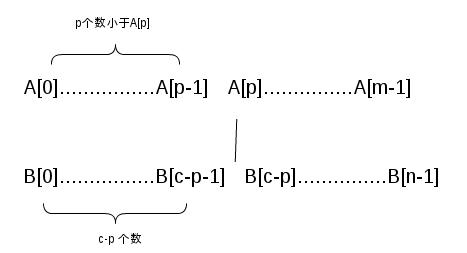

title: 求两个有序数组的中位数
date: 2015-05-11 01:25:32
categories:
- 笔试题
tags:
- java
- 笔试题
---

[原文](http://blog.csdn.net/kenby/article/details/6833407)，本文给出java实现

设数组A的长度为m, 数组B的长度为n， 两个数组都都是递增有序的。

求这两个数组的中位数

<!-- more -->

首先我们看看中位数的特点，一个大小为n的数组，

如果n是奇数，则中位数只有一个，数组中恰好有  (n-1)/2 个元素比中位数小。

如果n是偶数，则中位数有两个（下中位数和上中位数），这里我们只求下中位数，对于下中位数，

数组中恰好有(n-1)/2个元素比下中位数小。

此题中，中位数只有一个，它前面有 c = (m+n-1)/2 个数比它小。中位数要么出现在数组A中，

要么出现在数组B中，我们先从数组A开始找。考察数组A中的一个元素A[p]， 在数组A中，

有 p 个数比A[p]小，如果数组B中恰好有 c-p 个数比 A[p] 小， 则俩数组合并后就恰好有 c 个数比A[p]小，

于是A[p]就是要找的中位数。 如下图所示：



如果A[p] 恰好位于 B[c-p-1] 和 B[c-p] 之间，则 A[p] 是中位数

如果A[p] 小于 B[c-p-1] ，说明A[p] 太小了，接下来从 A[p+1] ~A[m-1]开始找

如果A[p] 大于 B[c-p] ，说明A[p] 太大了，接下来从 A[0] ~A[p-1]开始找。

如果数组A没找到，就从数组B找。

下面给出Java实现：

```java
public class FindMedian {

    /**
     * @param args
     */
    public static void main(String[] args) {
        // TODO Auto-generated method stub
        int[] a = {2, 3, 5, 7, 9, 13, 15, 19};
        int[] b = {1, 2, 3, 4, 5, 6, 7, 8, 10, 13, 15, 16, 19};
        
        System.out.print(findMedian(a, b, a.length, b.length, 0, a.length-1));
    }
    
    /**
     * 若m+n为奇数，放回中位数；偶数放回下中位数
     * @param a
     * @param b
     * @param m 数组a长度
     * @param n 数组b长度
     * @param s p的上下界线
     * @param t
     * @return 中位数
     */
    public static int findMedian(int[] a, int[] b, int m, int n, int s, int t){
        int c = (m+n-1)/2;
        int p = (s+t)/2;
        
        if(s>t) return findMedian(b, a, n, m, 0, n-1);
        if(a[p]>=b[c-p-1] && a[p]<=b[c-p]) return a[p];  //介于c-p-1,c-p之间则a[p]恰为中位数
        if(a[p]<b[c-p-1]) return findMedian(a, b, m, n, p+1, t);
        return findMedian(a, b, m, n, s, p-1);
    }

}
```