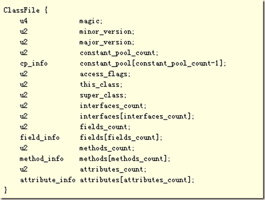
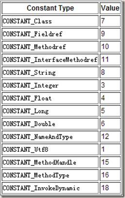
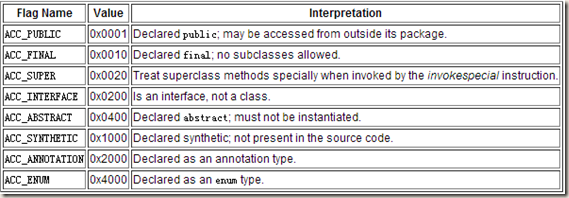
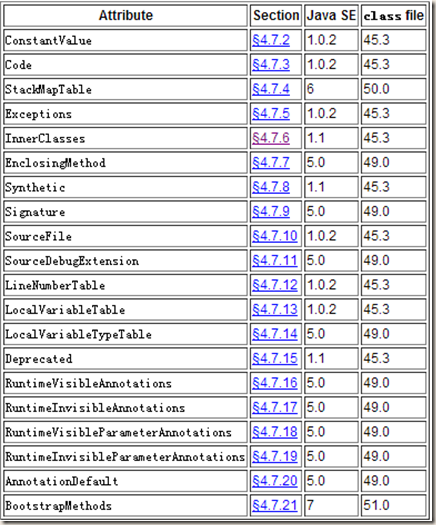

title: 了解Java Class文件结构
date: 2015-05-14 01:58:55
categories:
- 学习总结
tags:
- java
- class
- bytecode
---

我们都知道Java文件经过编译后是一个二进制的class文件，但多数情况下我们更了解Java语法，它能帮助我们编写漂亮的代码，但知道Java更底层的东西我们就能写出更高效的代码。在研究findbugs工具时，由于其使用BCEL来处理class文件，这就要求我们对class文件的基本结构有一定的了解。这里纯粹是记录我在学习class文件结构的一些总结，要更系统深入的学习可以查看官方文档[The Java Virtual Machine Specification][virtual]。
[virtual]: (http://docs.oracle.com/javase/specs/jvms/se7/html/)

> 1.class文件是由8个字节为基础的字节流构成的，这些字节流之间都严格按照规定的顺序排列，并且字节之间不存在任何空隙，对于超过8个字节的数据，将按照Big-Endian的顺序存储的。
2.class文件结构采用类似C语言的结构体来存储数据的，主要有两类数据项，无符号数和表，无符号数用来表述数字，索引引用以及字符串等，比如 u1,u2,u4,u8分别代表1个字节，2个字节，4个字节，8个字节的无符号数，而表是由多个无符号数以及其它的表组成的复合结构。

<!-- more -->

如下面的class文件结构：
 --FROM JVM规范

__magic__值是一个常数0xCAFEBABE，可用它来识别一个文件是否为class文件。

__minor_version，major_version__两个值指定了这个class文件的主次版本号，JVM可以通过该值来判断是否支持该class文件。

__constant_pool_count__这个值等于常量池中常量数量加1，介于0和constant_pool_count之间的constant_pool索引都是合法的。需要加1的原因是，当某一数据项索引为0表示该数据项不引用任何常量池中的常量。

__constant_pool[]__用来存储字符常量、类或接口名、字段名、方法名以及其他可能涉及到的常量，常量池几乎占据了60%的class文件。常量用表来存储，结构如下：

> cp_info {
    u1 tag; //1字节的tag指明是哪类的Constant
    u1 info[]; //其他信息，但都是固定字节的
}

JVM共定义了以下14种常量，以及其对应的tag。
 --FROM JVM规范

__access_flags__用于表示类或接口的访问信息public，private……，如图：
 --FROM JVM规范

__this_class__一个合法索引值，且该值索引到一个CONSTANT_Class_info类型的常量，表示class文件定义的类或接口。

__super_class__表示当前类的父类的索引值，索引值所指向的常量池中类型为CONSTANT_Class_info的常量，若super_class的值为零，则该class文件一定是Object。

__interfaces_count，interfaces[]__ interfaces_count表示实现接口数量，而每一个interfaces[i]分别对应一个常量池的常量，类型为CONSTANT_Class_info。

__fields_count、fields[]__fields_count表示类中field_info表的数量，而field_info表示类的实例变量和类

变量，这里需要注意的是 field_info不包含从父类继承过来的字段，field_info的结构如下图所示：

> field_info {
    u2             access_flags; //访问权限，不具体列出（private，public……）
    u2             name_index;  //一个CONSTANT_Utf8_info类型的常量，表示字段名称
    u2             descriptor_index;  //下面介绍
    u2             attributes_count;  //属性表的数量
    attribute_info attributes[attributes_count];  //后面介绍
}

descriptor_index对应到常量池的一个CONSTANT_Utf8_info 类型常量，且字段描述符表示如下：

> FieldDescriptor:
> > FieldType

> FieldType:
> > BaseType
> > ObjectType
> > ArrayType 

> BaseType:
> > B byte  //byte a,描述符B
C char
D double
F float
I int
J long
S short
Z boolean

> ObjectType:
> > L ClassName ;  //String str,描述符Ljava/lang/String;

> ArrayType:
> > [ ComponentType //一位数组表示，二维则[[。 double[][]，描述符[[D

>ComponentType:
> >FieldType

__methods_count、methods[]__methods_count表示方法表的个数，方法表结构如下所示：

> method_info {
    u2             access_flags; //访问标示，不具体列出（private，public……）
    u2             name_index;  //方法名称，对应到常量池
    u2             descriptor_index; //下面介绍
    u2             attributes_count; //属性表数量
    attribute_info attributes[attributes_count];  //后面介绍
}

MethodDescriptor的表示如下：

> MethodDescriptor:
( ParameterDescriptor* ) ReturnDescriptor

> ParameterDescriptor:
> > FieldType

> ReturnDescriptor:
> > FieldType
> >VoidDescriptor

> VoidDescriptor:
> > V

如Object m(int i, double d, Thread t) {..}方法的描述符为：(IDLjava/lang/Thread;)Ljava/lang/Object;。

__attributes_count，attributes[]__attributes_count表示属性表的数量。字段、方法和类文件都有attribute_info这种表，但表的类型是不相同的，表结构如下：

> attribute_info {
    u2 attribute_name_index;
    u4 attribute_length; 
    u1 info[attribute_length];
}

下面表格为JVM预定义的属性类型：

以上大致为class文件包含的所有内容，类中大部分信息都存储在常量池（编译后的指令在方法的code属性中）。深入的学习JVM推荐阅读[The Java Virtual Machine Specification](http://docs.oracle.com/javase/specs/jvms/se7/html/)，文章[《实例分析Java Class的文件结构》](http://www.jb51.net/article/35187.htm)以实例对class文件进行了讲解。