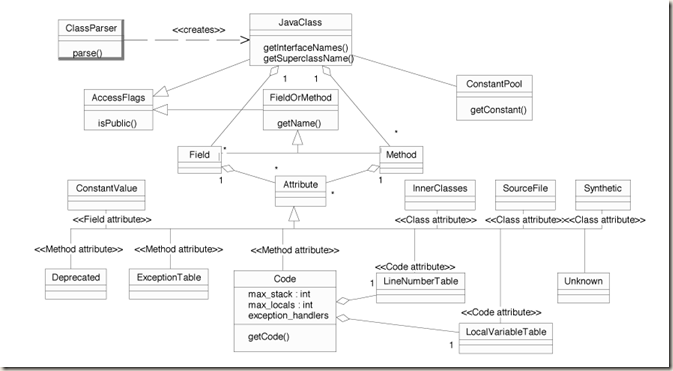
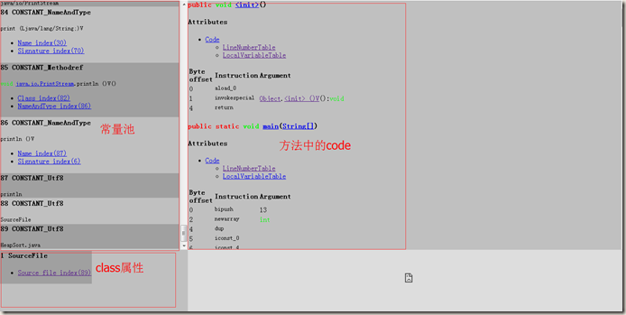

title: 借助BCEL
date: 2015-05-15 19:36:19
categories:
- 实践笔记
tags:
- bcel
- findbugs
---

BCEL是一个java字节码引擎库，有了他我们可以方便的表示出class文件的数据，另外BCEL还支持动态的创建和改变java class文件。这里我仅是初略的了解BCEL解释class文件的功能，为我后面学习FindBugs工具做准备，需要深入学习BCEL的创建、改变class文件的功能，可以查看官方文档。


<!-- more -->

这是org.apache.bcel.classfile包下的类，可以看到这些类展示了class文件所有的数据结构，JavaClass是一个java class文件的抽象，他可以通过ClassParser来得到。另外可用通过JavaClass实例来得到Constant、Field、Method等所用class文件数据：

```java
public static void main(String[] args) {
    // TODO Auto-generated method stub
    String classPath = "K:\\....\\HeapSort.class";
    try {
        JavaClass jClass = new ClassParser(classPath).parse();
        //Class2HTML class2html = new Class2HTML(jClass, "K:\\....\\");
        Method[] methods = jClass.getMethods();
        Method me = null;
        for(Method method : methods){
            System.out.println(method.toString());
            if(method.getName().equals("sort")) me = method;
        }
        
        System.out.println(me.toString());
        Code code = me.getCode();
        System.out.println(code.toString());
        Attribute[] attribute = me.getAttributes();
        System.out.println(attribute[0].toString());
        
        ConstantPool pool = jClass.getConstantPool();
        Constant[] constants = pool.getConstantPool();
        System.out.println("constant 数量："+constants.length);
    } catch (ClassFormatException e) {
        // TODO Auto-generated catch block
        e.printStackTrace();
    } catch (IOException e) {
        // TODO Auto-generated catch block
        e.printStackTrace();
    }
}
```

这里就不展示输出结果了，在org.apache.bcel.util包中有些工具类，如使用Class2HTML类可以把class文件的一些数据展示到HTML文件中：
