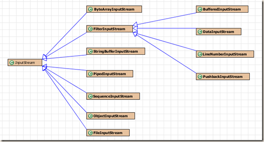
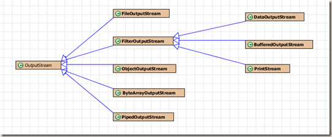
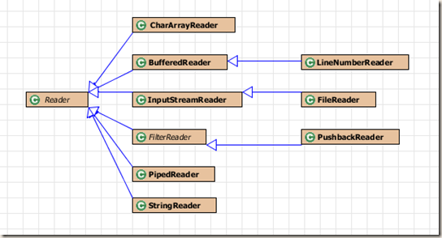
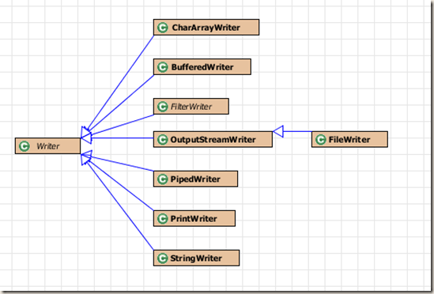

title: Java深入学习之 IO
date: 2015-05-16 19:37:11
categories:
- 学习总结
tags:
- java
- io
- stream
- reader
- writer
---

现实世界中我们总要处理不同的数据源：

> 1.字节数组。
2.String对象
3.文件。
4.“管道”，工作方式与实际管道相似。
5.一个有其他种类组成的序列。
6.其他数据源，如Interent连接等。  --From  《Java编程思想》

对于以上的数据源，Java io都提供了相对应的流处理类，如读取文件数据源FileInputStream，FileOutputStream，这些类都继承了InputStream这个抽象类，并重新实现了主要的接口。作为Java io的学习篇，这里主要分析了面向字节的io和面向字符的io。

<!-- more -->

## 面向字节
面向字节顾名思义他们在处理数据流时，是以字节为单位的。这些流处理类继承了InputStream和OutputStream两个抽象类。下面简单看下这两个父类具有的接口

### InputStream

```java
public abstract int read()
/*从输入流中读取相同个字节到b中，返回实际读取字节的个数，可能小于b的长度*/
public int read(byte b[])
/*读取最多len个字节到字节数组b中，且读取的第一个自己存放在b[off]，返回实际读取的字节个数*/
public int read(byte b[], int off, int len)
/*从输入流中跳过n字节，返回实际跳过的字节长度*/
public long skip(long n)
/*标记当前输入流的位置，结合reset函数使用，readlimit参数指明在mark失效之前，可从流中读取的字节长度*/
public synchronized void mark(int readlimit)
public synchronized void reset()
/*查看是否支持mark功能*/
public boolean markSupported()
```

以上是InputStream所具有的接口，最主要的函数功能便是从流中读取数据，其子类都该函数都有各自实现。下图为继承了InputStream的一些子类（仅存在于io包内的类），其中FilterInputStream是一个装饰器类，他持有一个InputStream对象，所以继承了FilterInputStream的类可以添加其他的功能。这就是为什么我们经常会用到将各种流组合使用的原因。

> BufferedInputStream bis = new BufferedInputStream(new FileInputStream(new File("")));



### OutputStream

```java
/*将b的低8位写到输出流中*/
public abstract void write(int b) throws IOException
/*将b字节数组写到输出流中*/
public void write(byte b[]) throws IOException
/*以off为b的起点，将len个长度的字节写入到输出流中*/
public void write(byte b[], int off, int len) throws IOException
```

可以看到OutputStream的接口就是将字节写入到输出流中，对于不同的数据源OutputStream同样有相应的子类。类似于FilterInputStream，FilterOutputStream同样是一个装饰器类以组合其他的流实现不同的功能。另外，我们常用的System.out对象就是一个PrintStream实例。


### 主要的Stream类
下面简单介绍下一些类的作用：

**ByteArrayInputStream/ByteArrayOutputStream**从缓冲区字节数组中读取到流/将流写到缓冲区字节数组（一种数据源）。

**FileInputStream/FileOutputStream**从文件读取数据到流/或将流写到文件中（数据源），经常搭配FileOutputStream使用。

**DataInputStream/DataOutputStream**以可移植的方式从流长读取/写入基本类型数据（int，char，long）。

**BufferedInputStream/BufferedOutputStream**每次读取/写入缓冲区（默认8k），避免每次进行实际操作，提高效率。

一个深拷贝的输入输出流示例，写入到byte数组中，同样也可以写入到其他流中：

```java
public Object deepCopy() throws Exception{
    //ByteArrayOutputStream
    ByteArrayOutputStream bo = new ByteArrayOutputStream();
    ObjectOutputStream oo = new ObjectOutputStream(bo);
    oo.writeObject(this);
    
    //读出二进制流产生的新对象
    ByteArrayInputStream ba = new ByteArrayInputStream(bo.toByteArray());
    ObjectInputStream oi = new ObjectInputStream(ba);
    return oi.readObject();
}
```

## 面向字符
以字符为单位处理流，有输入流抽象类Reader、输出流抽象类Writer。Reader、Writer并不能完全取代InputStream、OutputStream，但能更方便的对文本和字符类型的数据进行操作（支持Unicode，java的char是Unicode的）。Reader、Writer有类似于InputStream、OutputStream的接口，主要就是将byte操作改变成char操作，就不一一列出。

### Reader
```java
protected Object lock;
public int read(java.nio.CharBuffer target) throws IOException
```

Reader提供了一个lock锁属性，和read到CharBuffer的操作。lock默认是Reader对象本身（this），这样SubClass便可以使用这个对象来同步流的操作，这能达到更细粒度的同步操作（以后学习线程同步再来详细介绍，这里就先忽略）。同样CharBuffer在学习nio再来介绍。

来看一下Reader的继承结构：


大多数类都与Stream类相对应，就不详细解释具体用法了。需要注意打是，InputStreamReader使用StreamDecoder类可以将字节流转换到字符流，所以有如下用法：

> BufferedReader bReader = new BufferedReader(new InputStreamReader(System.in));

### Writer

```java
private char[] writeBuffer;
protected Object lock;
abstract public void write(char cbuf[], int off, int len) throws IOException;
public void write(String str, int off, int len) throws IOException
/*相当于write(csq.toString())*/
public Writer append(CharSequence csq) throws IOException
```

Writer增加了一些对String和CharSequence的写操作，writeBuffer用来暂时存放要被写入流的字符串或字符数组，其余的接口类似于OutputStream。Writer的类继承结构如下：


还是直接举一些流操作的例子，这些例子来自《Java编程思想》。这些流类需要结合使用，才能发挥其最大的功能

```java
public class BufferedInputFile {
    public static void main(String[] args) {
        //System.out.print(read("BufferedInputFile.java"));
        //memoryInput(read("BufferedInputFile.java"));
        //basicFileOut("BufferedInputFile.java");
        storingAndRecoveringData();
    }
    
    //缓冲输入文件
    public static String read(String file) {
        BufferedReader bReader;
        StringBuilder sb = new StringBuilder();
        try {
            bReader = new BufferedReader(new FileReader(file));
            
            String s;
            while((s=bReader.readLine()) != null){
                sb.append(s + "\n");
            }
            
            bReader.close();
        } catch (IOException e) {
            // TODO Auto-generated catch block
            e.printStackTrace();
        }
        return sb.toString();
    }
    
    //内存输入
    public static void memoryInput(String str){
        try {
            StringReader srReader = new StringReader(str);
            
            int c;
            while((c=srReader.read()) != -1) 
                System.out.print((char)c);
            srReader.close();
        } catch (IOException e) {
            // TODO Auto-generated catch block
            e.printStackTrace();
        }
    }
    
    //格式化的内存输入
    public static void formattedMemoryInput(byte[] b){
        DataInputStream in = new DataInputStream(
                new ByteArrayInputStream(b));
        
        try {
            while(in.available() != 0) //慎用available读取媒介不用，实现不同
                System.out.print((char)in.readByte());
            in.close();
        } catch (IOException e) {
            // TODO Auto-generated catch block
            System.out.println("end");
        }
    }
    
    //基本文件输出, 实际上文件输出常使用bufferedwriter，以得到更好的性能
    public static void basicFileOut(String file){
        try {
            BufferedReader in = new BufferedReader(new FileReader(file));
            PrintWriter pWriter = new PrintWriter(new FileWriter("test.txt"));
            
            int lineCount = 1;
            String string = "";
            while((string=in.readLine()) != null)
                pWriter.println(lineCount++ + ":" + string);
            pWriter.close();
            in.close();
            
            System.out.print(read("test.txt"));
        } catch (IOException e) {
            // TODO Auto-generated catch block
            e.printStackTrace();
        }
    }
    
    //存储和恢复数据     DataOutputStream  DataInputStream结合使用可以保证准确的读取数据
    public static void storingAndRecoveringData(){
        try {
            DataOutputStream outputStream = new DataOutputStream(
                    new BufferedOutputStream(new FileOutputStream("data.txt")));
            outputStream.writeDouble(3.1415926);
            outputStream.writeUTF("what a f");
            outputStream.writeUTF("hello world");
            outputStream.close();
            
            DataInputStream in = new DataInputStream(new FileInputStream("data.txt"));
            System.out.println(in.readDouble());
            System.out.println(in.readUTF());
            System.out.println(in.readUTF());
            in.close();
        } catch (IOException e) {
            // TODO Auto-generated catch block
            e.printStackTrace();
        }
    }
}
```

## RandomAccessFile
RandomAccessFile适用于大小已知的记录组成的文件，可以使用seek()方法将记录转移。RandomAccessFile仅实现了DataInput和DataOutput接口（故有很多readDouble(),writeDouble()等操作），与InputStream和OutputStream没有关系。

在JDK1.4中，RandomAccessFile的大多数功能被nio存储映射文件取代。

看一个实际操作例子：
```java
public static void usingRandomAccessFile(String file){
    try {
        RandomAccessFile rFile = new RandomAccessFile(file, "rw"); //rw读写
        for(int i=0; i<7; ++i){
            rFile.writeDouble(i*1.414);
        }
        rFile.writeUTF("end");
        rFile.close();
        display(file);
        rFile = new RandomAccessFile(file, "rw");
        rFile.seek(5*8);
        rFile.writeDouble(47.000144);
        rFile.close();
        display(file);
    } catch (IOException e) {
        // TODO Auto-generated catch block
        e.printStackTrace();
    }
}

public static void display(String file) throws IOException {
    RandomAccessFile rFile = new RandomAccessFile(file, "r"); //r仅读
    for (int i = 0; i < 7; ++i) {
        System.out.println("value " + i + ": " + rFile.readDouble());
    }
    System.out.println(rFile.readUTF());
    rFile.close();
}

public static void main(String[] args) {
    usingRandomAccessFile("hh.txt");
}
```

输出：

> value 0: 0.0
value 1: 1.414
value 2: 2.828
value 3: 4.242
value 4: 5.656
value 5: 7.069999999999999
value 6: 8.484
end
value 0: 0.0
value 1: 1.414
value 2: 2.828
value 3: 4.242
value 4: 5.656
value 5: 47.000144
value 6: 8.484
end