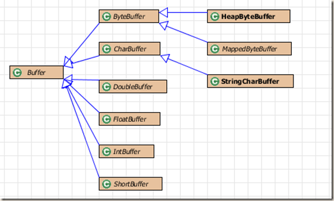

title: Java深入学习之NIO(1)
date: 2015-05-21 19:38:02
categories:
- 学习总结
tags:
- java
- io
- nio
---

JDK 在1.4添加了新的Java IO类，用以提高IO速度。实际上，旧的IO包已经使用NIO重新实现过，因此即使不显式使用NIO，也能获得速度上的提高。

<!-- more -->

先从例子说起：
```java
public class Nio {

    public static void main(String[] args) {
        // TODO Auto-generated method stub
        String src = "D:\\大数据竞赛\\train_data.txt";
        String des = "D:\\大数据竞赛\\train_data_copy.txt";
        
        long begin = System.currentTimeMillis();
        //fileCopy(src, des);
        copyUsingStream(src, des, 2048);//1024 523  2048 428
        System.out.print(System.currentTimeMillis()-begin);
    }
    
    //1024(3962),2048(1061),4096(688),8192 485
    public static void fileCopy(String src, String des){
        try {
            @SuppressWarnings("resource")
            FileChannel in = new FileInputStream(src).getChannel(),
                    out = new FileOutputStream(des).getChannel();
            ByteBuffer buffer = ByteBuffer.allocate(8192);
            while(in.read(buffer) != -1){
                buffer.flip();
                out.write(buffer);
                buffer.clear();
            }
            in.close();
            out.close();
        } catch (IOException e) {
            // TODO Auto-generated catch block
            e.printStackTrace();
        }
    }
        //1024 523 2048 428     public static void copyUsingStream(String src, String des, int byteSize){
        byte[] temp = new byte[byteSize];
        try {
            BufferedInputStream bufferedInputStream = 
                    new BufferedInputStream(new FileInputStream(src));
            BufferedOutputStream bufferedOutputStream = 
                    new BufferedOutputStream(new FileOutputStream(des));
            
            while(bufferedInputStream.read(temp) != -1){
                bufferedOutputStream.write(temp);
            }
            bufferedInputStream.close();
            bufferedOutputStream.close();
        } catch (IOException e) {
            // TODO Auto-generated catch block
            e.printStackTrace();
        }
        
    }
}
```

fileCopy和copyUsingStream都实现了一个拷贝文件的功能，不同的是fileCopy使用nio实现，copyUsingStream使用stream实现。其中Buffered Stream使用默认8192个字节大小的缓存，并使用一个temp字节数组来读取输入，和写入到输出。下面看看他们拷贝一个200m的文件使用的时间：

|buffer/temp size|1024   |2048   |4096   |8192   |
|:-------------:|:------:|:-----:|:-----:|:-----:|
|fileCopy       |	3962 |	1061 | 	688  |	485  |
|copyUsingStream|	523  |	428  |	425  | 	423  |

可以看到使用Java io使用了nio重新实现，且优化了性能。下面让我们来看看nio中需要接触到的东西。

### buffer
NIO具有更好的速度性能来自于其所使用的结构更近似于操作系统的IO方式：通道和缓冲器。下面先来看看缓冲器的实现：

buffer具有四个标志位：mark，position，limit，capacity；分别表示标记，位置，界线和容量。位置表示读或写操作是位置，界线用来界定读或许操作的终点，所以buffer在读写操作转换时，需要重新设置他们的标志（基本上是position，limit）。

> public final Buffer mark() //将mark=position，结合reset()使用
public final Buffer flip()//mark=-1,limit=postion,position=0.写转读操作调用
public final Buffer clear()//mark=-1,limit=capacity,position=0.写覆盖
public final Buffer rewind()//mark=-1，position=0重读



上面是buffer类的部分继承结构，在nio包中还用大量的拥有不同特性的buffer扩展，可以去查看源码。虽然基本类型有相应的buffer，但其底层都使用了ByteBuffer，ByteBuffer提供了视图功能，这样可以很方便的想ByteBuffer中读写基本数据类型。

```java
public static void viewBuffer(int bufferSize){
    //allocate将返回HeapByteBuffer实例
    ByteBuffer buffer = ByteBuffer.allocate(bufferSize);
    //支持各种基本数据类型
    IntBuffer intBuffer = buffer.asIntBuffer();
    intBuffer.put(new int[]{1, 2, 3, 4, 5, 6, 7});
    System.out.println(intBuffer.get(4));
    intBuffer.put(4, 1234);
    //从写转读
    intBuffer.flip();
    while(intBuffer.hasRemaining())
        System.out.println(intBuffer.get());
}
```

*注意：*不同机器或操作系统可能有不同的字节存放顺序，因此有时可能需要使用ByteOrder显式说明。

### MappedByteBuffer
MappedByteBuffer可以实现一个内存文件映射的能力，有了这个功能我们可以将非常大的文件，“假定”装在内存中，并且可以当做数组访问。

```java
public static void mapFile(){
    int length = 0x8FFFFFF;
    try {
        MappedByteBuffer map = new RandomAccessFile("test.txt", "rw").getChannel()
                .map(FileChannel.MapMode.READ_WRITE, 0, length);
        for(int i=0; i<length; ++i){
            map.put((byte)'x');
        }
        System.out.println("finish write");
        
        for(int i=length/2; i<length/2+6; i++){
            System.out.println((char)map.get(i));
        }
    } catch (FileNotFoundException e) {
        // TODO Auto-generated catch block
        e.printStackTrace();
    } catch (IOException e) {
        // TODO Auto-generated catch block
        e.printStackTrace();
    }
}
```

MappedByteBuffer将文件的一段放入内存中，上面将0到length长度的文本放到内存。使用RandomAccessFile可以对文件进行读写，FileInputStream和FileOutputStream仅能得到读或写权限。