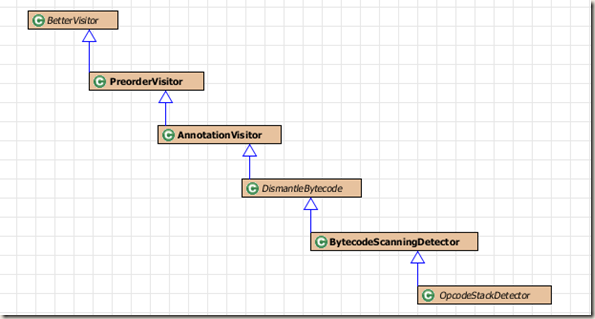

title: FindBugs检测器实现(1)
date: 2015-05-23 19:39:05
categories:
- 实践笔记
tags:
- findbugs
- detector
- opcode
---

FindBugs的检测器大多以下面五种方式来实现，且这五种实现方式findbugs都提供了接口：

> 1.检查类、方法、字段结构
2.微模式，简单的字节码模式
3.基于栈的模式
4.数据流分析
5.内部过程的分析

本文将介绍findbugs中stack-based pattern的实现过程和需要用到的接口。在这之前，我们必须要有一些必备的java知识，如JVM栈内存、JVM字节码指令、class文件结构。

<!-- more -->

### 字节码指令
JVM为每一个线程都分配一个java栈，且栈以栈帧的形式进行管理，每调用一个方法都向栈中添加一个栈帧，栈帧由局部变量区、操作数区、和帧数据区组成。看一个简单的字节码指令示例：

```java
public static void main(String[] args) {
    BigDecimal a = new BigDecimal(0.11);
}
```
*指令：*
>   0: new           #28    // class java/math/BigDecimal
    3: dup
    4: ldc2_w        #30    // double 0.11d
    7: invokespecial #32    // Method java/math/BigDecimal."<init>":(D)V
    10: astore_1
    11: return

main方法中仅有一条语句，它创建了一个BigDecimal类实例，并把它赋值给本地变量a。左边方框是main函数的字节码指令，我们来看看这些指令对main方法栈帧的操作。（new）创建BigDecimal对象，并向栈顶压入引用值；（dup）复制栈顶引用，压栈；（ldc2_w）从常量池中将0.11d推送到栈顶；（invokespecial）调用构造函数，并弹出对象引用和参数，调用结束将对象引用压栈；（astore_1）弹出对象引用，并存储在main函数的局部变量1位置（0位置为main方法参数）；（return）返回。了解JVM的栈结构和字节码指令对栈的操作，这样我们才能使用stack来分析java代码中一些不好的模式。

### OpcodeStackDetector
使用Stack-based来实现findbugs的检测器都要继承OpcodeStackDetector这个类，并且实现sawOpcode(int)方法。这个方法传入的操作码的值，根据这个值我们可以得到操作数的信息，如操作码是函数调用，则能获取到函数的名称、描述符等信息。另外我们还能获取到方法栈数据，程序计数器等数据，使用这些数据便能实现想要检测的代码模式。

先来看下OpcodeStackDetector的继承结构：


这些类的主要作用是：

**BetterVisitor**定义了许多visit方法，这些方法用来实现对class文件对象的访问（JavaClass，Method等）。

**DismantleBytecode**用来分析字节码，提取操作码、操作数、计数器等数据。这个类实现了visit(Code)方法，并为每一个操作码调用sawOpcode(int)方法。

**OpcodeStackDetector**类有操作数stack数据，对于stack based模式检测是必不可少的。另外还定义了sawOpcode(int)方法，我们的检测代码在该方法中实现。

### 检测器例子
仍以[从定义最简单Findbugs Detector做起](http://panzhihui.github.io/20150511/从定义最简单Findbugs-Detector做起/)提到的检测器做为例子，用来检测BigDecimal实例使用Double进行构造，另外每次调用sawOpcode函数，都打印出方法栈信息：
```java
public void sawOpcode(int seen) {
    //System.out.println("visit seen:" + seen);
    // TODO Auto-generated method stub
    if (seen == INVOKESPECIAL && getClassConstantOperand().equals("java/math/BigDecimal")
            && getNameConstantOperand().equals("<init>") && getSigConstantOperand().equals("(D)V")) {
        OpcodeStack.Item top = stack.getStackItem(0);
        Object value = top.getConstant();
        System.out.println("stack num local values:" + stack.getNumLocalValues() + 
                "  stack depth"+ stack.getStackDepth());
        if (value instanceof Double) {
            double arg = ((Double) value).doubleValue();
            String dblString = Double.toString(arg);
            String bigDecimalString = new BigDecimal(arg).toString();
            boolean ok = dblString.equals(bigDecimalString) || dblString.equals(bigDecimalString + ".0");

            if (!ok) {
                boolean scary = dblString.length() <= 8 && dblString.toUpperCase().indexOf("E") == -1;
                bugReporter.reportBug(new BugInstance(this, "TUTORIAL_BUG", scary ? NORMAL_PRIORITY : LOW_PRIORITY)
                        .addClassAndMethod(this).addString(dblString).addSourceLine(this));
            }
        }
    }
    System.out.println("stack num local values in return:" + stack.getNumLocalValues() + 
                "  stack depth:"+ stack.getStackDepth());
    for(int i=0; i<stack.getStackDepth(); ++i)
        System.out.println("stack item "+i+":" + stack.getStackItem(i));
}
```

首先if语句判断操作码是一个构造函数调用，且方法名、类名、方法描述符都符合，以验证这是一个BigDecimal初始化；再取出执行此字节命令时的栈顶操作数stack.getStackItem(0)，上面的代码用该double构造BigDecimal实例，判断dblString.equals(bigDecimalString)来确定是否报告这个警告。

将该检测器放到findbugs中，检测第一部分提到的字节码，栈信息输出如下：


前面提到了visit方法，这些方法在findbugs分析到相应的class文件部分时会被调用，如visit(JavaClass obj)方法在分析class文件时调用；visit(Method me)方法在findbugs分析方法时调用；visit(Code code)在findbugs分析字节码指令是调用。需要注意的是，调用visit(Code code)时，一定要调用super.visit(code)方法，否则我们实现的sawOpcode方法将不会调用，因为sawOpcode是在super.visit(code)方法中调用的。

```java
public void visit(Code code){
    System.out.println("visit code!!!!!!!");
    //System.out.println("code:" + code.toString());
        
    //yi ding yao fang wen zhe ge
    super.visit(code);
}
```

使用visit方法可以实现必要的初始化操作，如某些变量在对字节码检测之前设置出事状态，那么可以把这些操作放在visit(Code)中，这样在每一次分析方法字节码时，状态都将被重置。