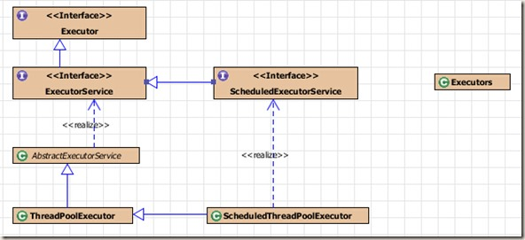

title: Java多线程 线程池
date: 2015-06-09 19:40:06
categories:
- 学习总结
tags:
- java
- thread
- pool
---

实现一个线程需要实现Runnable接口，或继承Thread类并实现run()方法。在run()方法中定义你需要线程完成的任务。
线程的一些操作和特征：

> 1.从线程中返回值，可以实现Callable接口，并重写call方法。
2.线程休眠TimeUnit.MILLISECONDS.sleep()，TimeUnit是一个枚举类
3.线程可以设置优先级
4.线程让步yield()
5.后台线程daemon，非后台线程结束时，后台线程将被杀死

<!-- more -->

```java
public class LiftOff implements Runnable {

    protected int countDown = 10;
    private static int taskCount = 0;
    private final int id = taskCount++;
    
    public LiftOff(){
        
    }
    public LiftOff(int count){
        this.countDown = count;
    }
    
    public String state(){
        return "#"+id+"("+(countDown>0?countDown:"LiftOff")+").";
    }
    @Override
    public void run() {
        // TODO Auto-generated method stub
        while(countDown-- > 0){
            System.out.print(state());
            Thread.yield();
        }
        System.out.println("liftoff already!!");
    }

}
```
## 线程池接口


为了简化多线程编程java SE5提供了执行器类来为我们管理Thread对象，执行器类在最底层定义了一个Executor接口，并声明了一个execute方法。

### ExecutorService
是真正意义上的线程池接口，其声明了一些线程池的基本方法，submit方法向线程池中提交一个任务并返回一个Future对象；shutdown方法在执行完先前提交的任务后，不再接受新任务；shutdownNow方法 试图停止所有正在执行的任务，停止等待执行的任务，并返回等待执行任务列表。ExecutorService还有声明了批量执行任务的方法，就不详细介绍了。

### ThreadPoolExecutor
是真正的线程池实现。其实现了Executor的execute方法，execute方法与submit方法的区别在于execute是没有返回值的。作为线程池，应当提供的功能有设置线程池的线程数量，提供存放等待执行线程的容器，以及对过剩的任务的处理方式，下面来看看ThreadPoolExecutor的构造函数。
```java
public ThreadPoolExecutor(int corePoolSize,
                              int maximumPoolSize,
                              long keepAliveTime,
                              TimeUnit unit,
                              BlockingQueue<Runnable> workQueue,
                              ThreadFactory threadFactory,
                              RejectedExecutionHandler handler)
```

*corePoolSize*线程池中维持的线程数量，即使有线程是空闲的。

*maximumPoolSize*线程池中最大的线程数

*keepAliveTime*超出corePoolSize的线程，在结束之前维持等待新任务的空闲状态时间

*unit*时间单元SECONDS、MILLISECONDS、MICROSECONDS…

*workQueue*用于保存等待执行的任务，需要注意的是该队列仅保持有execute提交的任务

*threadFactory* executor创建新线程使用的工厂

*handler*用来处理超出线程池容量的任务

1.向线程池中提交一个任务，当线程池中的线程数量少于corePoolSize时，会立即创建一个新的线程来处理该任务，而不管线程池中是否存在空闲线程；线程数量大于corePoolSize而少于maximumPoolSize时，会查看workQueue的情况，只有workQueue已满时，才会创建新线程来处该任务。
2.可以使用prestartCoreThread或prestartAllCoreThreads()来创建空闲线程等待任务执行。
3.线程由ThreadFactory 创建，默认有Executors的ThreadFactory ，创建具有相同的线程组、优先级、和非后台的线程。
4.任务队列workQueue有三种类型，直接提交（Direct handoffs）、无界队列（Unbounded queues）、有界队列（Bounded queues）。

> - 直接提交，工作队列的默认选项是 SynchronousQueue，它将任务直接提交给线程而不保持它们。在此，如果不存在可用于立即运行任务的线程，则试图把任务加入队列将失败，因此会构造一个新的线程。此策略可以避免在处理可能具有内部依赖性的请求集时出现锁。直接提交通常要求无界maximumPoolSizes 以避免拒绝新提交的任务。当命令以超过队列所能处理的平均数连续到达时，此策略允许无界线程具有增长的可能性。简单的讲，这种方式
> - 无界队列，使用无界队列（例如，不具有预定义容量的 LinkedBlockingQueue）将导致在所有 corePoolSize 线程都忙时新任务在队列中等待。这样，创建的线程就不会超过 corePoolSize。（因此，maximumPoolSize的值也就无效了）当每个任务完全独立于其他任务，即任务执行互不影响时，适合于使用无界队列；例如，在 Web页服务器中。这种排队可用于处理瞬态突发请求，当命令以超过队列所能处理的平均数连续到达时，此策略允许无界线程具有增长的可能性。
> - 有界队列，当使用有限的 maximumPoolSizes时，有界队列（如 ArrayBlockingQueue）有助于防止资源耗尽，但是可能较难调整和控制。队列大小和最大池大小可能需要相互折衷：使用大型队列和小型池可以最大限度地降低 CPU 使用率、操作系统资源和上下文切换开销，但是可能导致人工降低吞吐量。如果任务频繁阻塞（例如，如果它们是 I/O边界），则系统可能为超过您许可的更多线程安排时间。使用小型队列通常要求较大的池大小，CPU使用率较高，但是可能遇到不可接受的调度开销，这样也会降低吞吐量。

5.任务拒绝RejectedExecutionHandler用来处理Executor关闭、有限队列及有限的maximumPoolSize的容量超出问题。ThreadPoolExecutor定义了四种类型的RejectedExecutionHandler
> - ThreadPoolExecutor.AbortPolicy抛出运行时RejectedExecutionException异常
> - ThreadPoolExecutor.CallerRunsPolicy线程调用运行该任务的 execute 本身。此策略提供简单的反馈控制机制，能够减缓新任务的提交速度。
> - ThreadPoolExecutor.DiscardPolicy不能执行的任务将被抛弃
> - ThreadPoolExecutor.DiscardOldestPolicy如果执行程序尚未关闭，则位于工作队列头部的任务将被删除，然后重试执行程序（如果再次失败，则重复此过程）

6.Hook函数，这个类提供了beforeExecute(Thread, Runnable)，afterExecute(Runnable, Throwable)接口，在执行一个任务的前后调用。

### ScheduledExecutorService
是一个**ExecutorService**，它提供了在给定一个延时或周期性调度任务的功能。
```java
public ScheduledFuture<?> schedule(Runnable command,
                                       long delay, TimeUnit unit);
public <V> ScheduledFuture<V> schedule(Callable<V> callable,
                                           long delay, TimeUnit unit);
public ScheduledFuture<?> scheduleAtFixedRate(Runnable command,
                                                  long initialDelay,
                                                  long period,
                                                  TimeUnit unit);
public ScheduledFuture<?> scheduleWithFixedDelay(Runnable command,
                                                     long initialDelay,
                                                     long delay,
                                                     TimeUnit unit);
```

前两个函数在等待延时delay后执行任务；scheduleAtFixedRate在等待时间delay后，并以period重复执行任务；scheduleWithFixedDelay在等待初始延时initialDelay后，并每次执行任务后等待delay重复执行任务。

### Executors
Executors主要是提供了一些工厂方法，用来产生常用的线程池：

> 1.public static ExecutorService newCachedThreadPool()，采用SynchronousQueue来保存等待运行的任务，maximumPoolSize为Integer的最大值。
> 2.public static ExecutorService newFixedThreadPool()，指定大小的线程池corePoolSize 和maximumPoolSize的大小相同，使用无界队列LinkedBlockingQueue。
> 3.public static ExecutorService newSingleThreadExecutor()，大小为1的FixedThreadPool，使用无界队列LinkedBlockingQueue
> 4.public static ScheduledExecutorService newScheduledThreadPool，创建可以指定延时执行或指定执行周期的线程池

```java
public static void cachedPool() {
    ExecutorService exec = Executors.newCachedThreadPool();

    for (int i = 0; i < 5; ++i) {
        exec.submit(new LiftOff());
    }
    exec.shutdown();
}

public static void fixedPool() {
    ExecutorService exec = Executors.newFixedThreadPool(3);
    for (int i = 0; i < 5; ++i) {
        exec.submit(new LiftOff());
    }
    exec.shutdown();
}

public static void singleThread() {
    ExecutorService exec = Executors.newSingleThreadExecutor();
    for (int i = 0; i < 5; ++i) {
        exec.submit(new LiftOff());
    }
    exec.shutdown();
}

public static void scheduledThread() {
    ScheduledThreadPoolExecutor exec = (ScheduledThreadPoolExecutor)                 Executors.newScheduledThreadPool(2);
    exec.scheduleAtFixedRate(new LiftOff(), 3, 12,
             TimeUnit.SECONDS);
    exec.scheduleAtFixedRate(new LiftOff(), 3, 6,
             TimeUnit.SECONDS);
}
```

*参考资料：*[java自带线程池和队列详细讲解](http://blog.csdn.net/sd0902/article/details/8395677), JDK 1.7 API