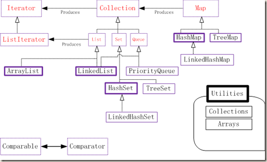

title: Java 容器
date: 2015-06-29 19:41:55
tags:
---

在实际问题中我们经常需要处理数据，单纯依靠数组来存储数据对开发来说非常困难，java提供了一套容器来方便我们编程。对java容器有一个整体的了解对我们来说非常重要，这样在需要特定容器时，不会手忙脚乱，本文主要介绍java的一些基本容器，而不要仅知道使用ArrayList。

<!-- more -->

下面的图片是java中的简单容器分类
图片来自网络

java定义了四种容器类型，List、Set、Queue和Map。

其中List、Set、Queue都实现了Collection接口，下面来看看这4中类型的容器。

### Collection

下面是Collection所拥有的操作，通过函数名都能大致明白它的意义，这里就不做介绍。
```java
int size();
boolean isEmpty();
boolean contains(Object o);
Iterator<E> iterator();
Object[] toArray();
<T> T[] toArray(T[] a);
boolean add(E e);
boolean remove(Object o);
boolean containsAll(Collection<?> c);
boolean addAll(Collection<? extends E> c);
boolean removeAll(Collection<?> c);
boolean retainAll(Collection<?> c);
void clear();
boolean equals(Object o);
int hashCode();
```
### List
提供基于索引的对成员的随机访问，在Collection的基础上，添加了list的特性。实现list接口的容器类型主要有下面两种：

> - ArrayList基于数组来实现，所有随机访问性能好。
> - LinkedList是一个双向的链表，LinkedList不仅实现了List接口，还实现了Deque接口。Deque是一个双端队列数据结构，继承了Queue接口。LinkedList这个容器可以同时作为list，同时也可以用来存储队列和栈结构数据。

### Set
是一种没有重复对象的容器。

> - HashSet可以用来做高性能集运算的，例如对两个集合求交集、并集、差集等。集合中包含一组不重复出现且无特性顺序的元素。底层实现使用了一个hashmap。
> - TreeSet是依靠TreeMap来实现的。TreeSet是一个有序集合，TreeSet中的元素将按照升序排列，缺省是按照自然排序进行排列，意味着TreeSet中的元素要实现Comparable接口。
> - LinkedHashSet，基于LinkedHashMap

### Map
> - HashMap用来存储键值的数据结构，键和值都可以为null。HashMap采用数组结合链表来实现，链表可以解决hash冲突问题。另外需要注意HashMap与HashTable的区别，他们两的实现方式是完全不同的，HashTable是线程安全的，使用了自身对象锁。
> - TreeMap和HashMap用法大致相同，但TreeMap按自然顺序或自定义顺序遍历键(key)。
> - LinkedHashMap是HashMap的一个子类，它保留插入的顺序，如果需要输出的顺序和输入时的相同，那么就选用LinkedHashMap。
> - ConcurrentHashMap并非直接继承map，提供并发的检索和更新操作，功能规范和hashtable一样，不允许空键、空值。ConcurrentHashMap使用了显式锁Lock，锁的粒度更细。

Collections和Arrays是两个工具类，提供了很多静态的方法，用来处理集合对象和数组对象。