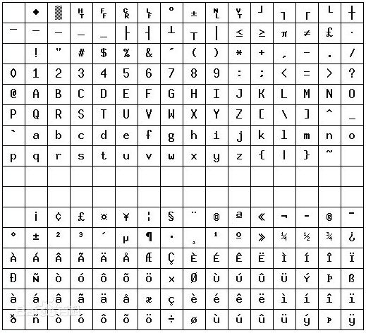
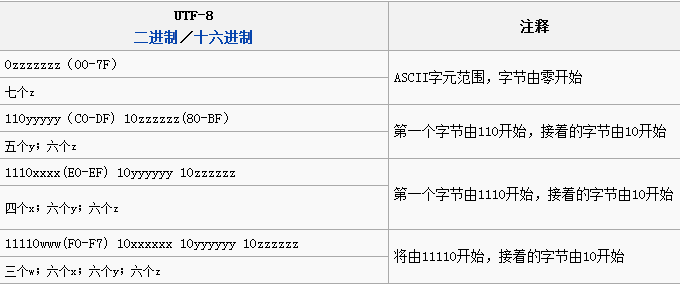

title: 'ISO-8859-1, ASCII, GB 2312, Unicode字符集解析'
date: 2016-01-18 17:47:02
categories:
- 学习总结
tags: 
- ASCII 
- GB2312
- unicode
- 字符集
toc:
author:
comments:
original:
permalink: 
---

　　在编程方面经常遇到字符编码的问题，由于对字符集没有一个系统的认识，总是被乱码搞得一头雾水，这篇博文则是对字符编码方面的进行了一下整理，以便日后复习。在学习字符集的过程中，我主要从字符集的（a）编码方式，（b）占用字节，两个方面来进行分析的。

<!-- more -->

## ISO-8859-1/ASCII

*参考资料：*[ISO-8859-1](http://baike.baidu.com/link?url=gmGjn47Eajv-Mfqfx9fO-t_0tVXClD_MDB5jWPsVlze9GcC7eyqU2I_ggpmA1TzPCNWTbnbnDPYsAGBQiRPi4a "ISO-8859-1")

### Latin1介绍
　　ISO-8859-1(Latin1)编码是单字节编码，向下兼容ASCII，其编码范围是0x00-0xFF，0x00-0x7F之间完全和ASCII一致，0x80-0x9F之间是控制字符，0xA0-0xFF之间是文字符号。因为ISO-8859-1编码范围使用了单字节内的所有空间，在支持ISO-8859-1的系统中传输和存储其他任何编码的字节流都不会被抛弃。换言之，把其他任何编码的字节流当作ISO-8859-1编码看待都没有问题。下图为ISO-8859-1字符集（包括ASCII字符集，图片来自百科）的编码表，编码方式。



### 测试
　　在下面代码中，字符串str"úù§ABD"的前三个字符由于不在ASCII编码范围内，故变量asc不能还原为源字符串。由byte数组的长度来看，ISO-8859-1和ASCII为单字节编码。

``` java
public static void iso(){
    String str = "úù§ABD";
    try {
        byte[] ch = str.getBytes("ISO-8859-1");
        String asc = new String(ch, "ASCII");
        String iso = new String(ch, "ISO-8859-1");
        System.out.println(str+" length:"+ch.length+" bytecode:"+byte2hex(ch)+"\nASCII:"+asc +"\nISO-8859-1:"+iso);
    } catch (UnsupportedEncodingException e) {
        // TODO Auto-generated catch block
        e.printStackTrace();
    }
}
```

输出:

> úù§ABD length:6 bytecode: fa f9 a7 41 42 44
> ASCII:???ABD
> ISO-8859-1:úù§ABD   

## GBK/GB2312

*参看资料：*[GB 2312](http://baike.baidu.com/link?url=90R7ukFXUfONX9n6EccJc-gNcAipa6-euVrxRuJunI7u0yYjpZEYzQiZIvT9CeDVl4lF--_cdFOKpCI5UqS3BVr_VQGuP0cNL7G0zfdQoY_jcw3EHSztVXUIylXYR2sKfgGDqVhT1k46rI5npH5pdK "GB 2312"), [GBK](http://baike.baidu.com/link?url=iLbHllL0UclVzTRXyV5SB2kxvqxzK-dMeKBlSG8XFdOeqvu0CfxXBphPzhhBZksTHU2jKPcGnqg_Spi-TQHlVyEKSRiY0AHYDataqFcbRTq "GBK")

### 国标码介绍
　　GB 2312标准共收录6763个汉字，其中一级汉字3755个，二级汉字3008个；同时，GB 2312收录了包括拉丁字母、希腊字母、日文平假名及片假名字母、俄语西里尔字母在内的682个全角字符。GB 2312的出现，基本满足了汉字的计算机处理需要，它所收录的汉字已经覆盖中国大陆99.75%的使用频率。对于人名、古汉语等方面出现的罕用字，GB 2312不能处理，这导致了后来GBK及GB 18030汉字字符集的出现。

　　**汉字区位码：**
　　GB 2312中对所收汉字（字符）进行了“分区”处理，每区含有94个汉字/符号。每个汉字可以使用一个4位的十进制表示，称为区位码，前两位为区码，后两位为位码。
> 01-09区为特殊符号。
> 16-55区为一级汉字，按拼音排序。
> 56-87区为二级汉字，按部首/笔画排序。
> 10-15区及88-94区则未有编码。

　　举例来说，“啊”字是GB2312之中的第一个汉字，它的区位码就是1601（十进制）。

　　**字节编码方式：**
　　在使用GB2312的程序中，通常采用EUC储存方法（分别将区码和位码加上0xA0），以便兼容于ASCII。
　　每个汉字及符号以两个字节来表示。第一个字节称为“高位字节”（也称“区字节）”，第二个字节称为“低位字节”（也称“位字节”）。
　　“高位字节”使用了0xA1-0xF7(把01-87区的区号加上0xA0)，“低位字节”使用了0xA1-0xFE(把01-94加上 0xA0)。 由于一级汉字从16区起始，汉字区的“高位字节”的范围是0xB0-0xF7，“低位字节”的范围是0xA1-0xFE，占用的码位是 72*94=6768（72个汉字分区）。其中有5个空位是D7FA-D7FE。
　　以“啊”字为例，“高位字节”：0x10(16)+0xA0=0xB0, “低位字节”：0x01(01)+0xA0=0xA1。“啊”编码为0xB0A1
GBK全称《汉字内码扩展规范》，GBK编码，是在GB2312-80标准基础上的内码扩展规范，使用了双字节编码方案，其编码范围从8140至FEFE（剔除xx7F），共23940个码位，共收录了21003个汉字。GBK为对GB2312的一次扩充，其高位字节不再要求区号加0xA0，低位字节甚至不要求首位bit为1，这样大大扩充了GB2312的可编码范围。

### 测试

```java
public static void gb(){
    String str = "啊aA";
    byte[] ch;
    try {
        ch = str.getBytes("GB2312");
        System.out.println("ch length:"+ch.length+" bytecode:"+byte2hex(ch));
        ch = str.getBytes("GBK");
        System.out.println("ch length:"+ch.length+" bytecode:"+byte2hex(ch));
    } catch (UnsupportedEncodingException e) {
        // TODO Auto-generated catch block
            e.printStackTrace();
    }
}
```

输出：
> ch length:4 bytecode: b0 a1 61 41
> ch length:4 bytecode: b0 a1 61 41

　　从程序可以看出GB2312，GBK是不定长的，汉字为2个字节，英文字符为一个字节。由于表示汉字或图形符号的“高位字节”的首个bit都为1，而ASCII首个bit为0，而实现了这两种字符集对ASCII的兼容。

## Unicode/UTF-8/UTF-16/UTF-32
*参考资料：*[Unicode][Unicode], [UTF-8][UTF-8], [UTF-16][UTF-16], [UTF-32][UTF-32], [通用字符集][通用字符集]
[Unicode]: https://zh.wikipedia.org/wiki/Unicode
[UTF-8]: https://zh.wikipedia.org/wiki/UTF-8
[UTF-16]: https://zh.wikipedia.org/wiki/UTF-16
[UTF-32]: https://zh.wikipedia.org/wiki/UTF-32
[通用字符集]: https://zh.wikipedia.org/wiki/通用字符集

### Unicode介绍
　　Unicode伴随着通用字符集的标准而发展，Unicode至今仍在不断增修，每个新版本都加入更多新的字符。目前最新的版本为2014年6月16日公布的7.0.0。实际应用的Unicode版本对应于UFT-16。Unicode通常会用“U+”然后紧接着4个十六进制的数字来对应一个常用字符，如”U+4EA0“代表某一个字符，若需要表示更多的字符则需要使用五位或六位十六进制数，这是Unicode对字符的表示方式。

　　UTF（Unicode transfromation format)是Unicode的不同实现，这里的实现指的是字符在计算机中的表示方式。

　　UTF-8是一种针对Unicode的可变长度字符编码，它可以用来表示Unicode标准中的任何字元，且其编码中的第一个字节仍与ASCII兼容。下图是字符在UTF-8中的编码方式，UTF-8可能使用3、4或更多个字节表示一个字符。



　　UTF-16使用两个字节表示常用的字符（码位从U+0000至U+FFFF），对于超出U+FFFF外的字符需要4字节表示，这里仅表示大致理解，深入了解请查看维基百科[UTF-16](https://zh.wikipedia.org/wiki/UTF-16)。

　　UTF-32是另一种将Unicode字符编码的协议，对每一个Unicode码位均使用定长的4字节来表示。

### 测试
```java
public static void unicode(){
    String str1 = "中文测试";
    byte[] ch;
    try {
        ch = str1.getBytes("unicode");
        System.out.println(str1+" length:"+ch.length+" unicode:"+byte2hex(ch));
        ch = str1.getBytes("utf-8");
        System.out.println(str1+" length:"+ch.length+" utf-8:"+byte2hex(ch));
        ch = str1.getBytes("utf-16");
        System.out.println(str1+" length:"+ch.length+" utf-16:"+byte2hex(ch));
        ch = str1.getBytes("utf-32");
        System.out.println(str1+" length:"+ch.length+" utf-32:"+byte2hex(ch));
        str1 = "test";
        ch = str1.getBytes("unicode");
        System.out.println(str1+" length:"+ch.length+" unicode:"+byte2hex(ch));
        ch = str1.getBytes("utf-8");
        System.out.println(str1+" length:"+ch.length+" utf-8:"+byte2hex(ch));
        ch = str1.getBytes("utf-16");
        System.out.println(str1+" length:"+ch.length+" utf-16:"+byte2hex(ch));
        ch = str1.getBytes("utf-32");
        System.out.println(str1+" length:"+ch.length+" utf-32:"+byte2hex(ch));
    } catch (UnsupportedEncodingException e) {
        // TODO Auto-generated catch block
        e.printStackTrace();
    }
}
```

输出：
> 中文测试 length:10 unicode: fe ff 4e 2d 65 87 6d 4b 8b d5
> 中文测试 length:12 utf-8: e4 b8 ad e6 96 87 e6 b5 8b e8 af 95
> 中文测试 length:10 utf-16: fe ff 4e 2d 65 87 6d 4b 8b d5
> 中文测试 length:16 utf-32: 00 00 4e 2d 00 00 65 87 00 00 6d 4b 00 00 8b d5
> test length:10 unicode: fe ff 00 74 00 65 00 73 00 74
> test length:4 utf-8: 74 65 73 74
> test length:10 utf-16: fe ff 00 74 00 65 00 73 00 74
> test length:16 utf-32: 00 00 00 74 00 00 00 65 00 00 00 73 00 00 00 74

　　从实验结果来看，UTF-8使用3个字节表示中文字符，1字节表示英文字符。UTF-32使用4个字节来表示每一种字符。在Unicode和UTF-16用两个字节表示中英文字符，且前端均有一个feff字节，该字节为BOM（Byte Order Mark）表示字节读取顺序。

　　本文主要记录了作者学习字符集的过程，如有错误，望谅解指正。