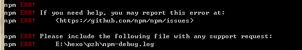
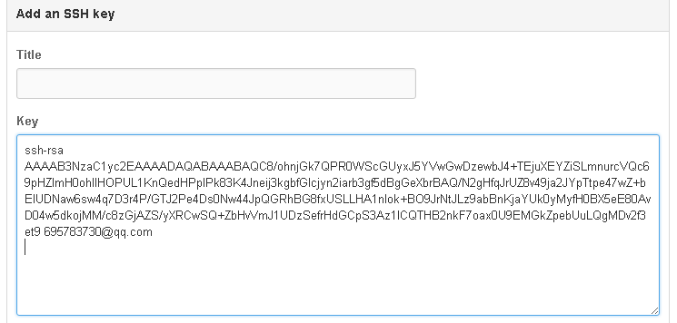
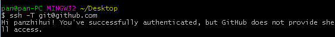
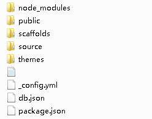

title: 使用hexo及github搭建个人博客记录
tags:
  - hexo
  - github
  - blog
categories:
  - 实践笔记
date: 2016-01-19 23:45:54
toc:
author:
comments:
original:
permalink:
---

　　记录本人使用hexo框架在github平台上搭建个人博客的过程。[Hexo][hexo] 是一个快速、简洁且高效的博客框架。Hexo 使用 Markdown（或其他渲染引擎）解析文章，在几秒内，即可利用靓丽的主题生成静态网页。[GitHub][github]是一个利用Git进行版本控制、专门用于存放软件代码与内容的共享虚拟主机服务。Hexo在本地可以一键轻松建立站点，并通过简单的配置，将站点部署到GitHub平台上。本文系统为WIN7 32位，需要用到以下环境：
[hexo]: https://hexo.io/zh-cn/docs/index.html "hexo"
[github]: https://github.com/ "github"

> - [Node.js][node], 版本v5.4.1，Hexo基于该框架
> - [Git for Windows][git], 使用最新版即可

[node]: https://nodejs.org/en/ "node.js"
[git]: http://git-scm.com/download/win "git"

<!-- more -->
## 环境准备
　　我们需要搭建Hexo环境，以及配置Git环境（向GitHub上部署博客站点时需要）
### Hexo环境搭建
　　Hexo框架是Node.js框架下的一个包，在windows上一键安装Node.js环境后，使用Node.js下的包管理工具npm即可一键安装Hexo框架，命令如下：

> npm install -g hexo

　　在[Hexo教程官网](https://hexo.io/zh-cn/docs/ "Hexo教程")上使用的命令是`npm install -g hexo-cli`，而本人在实际操作过程中使用该命令安装hexo-cli后，在创建站点（后续章节介绍）执行`npm install`命令时出现下图错误，改用`npm install -g hexo`安装完整hexo后，则没有问题。

### Git环境准备
　　在Git for Windows安装完成后，就具备了本地的git环境，我们需要做的是连接到我们的github上，需要以下步骤：
1.创建github账号（已有忽略本步骤）
2.在git bash窗口下，设置Git的account和email

> git config --global user.name "github account"
> git config --global user.email "email used in github"

3.生成秘钥

> ssh-keygen -t rsa -C "your email address"

　　此步骤会有多个输入，连续回车即可。最后会在系统盘的用户目录下生成一个.ssh目录，里面包含id_rsa和id_rsa.pub两个文件。

4.登入GitHub，add SSH key
　　在用户的设置里面，添加SSH key，将id_rsa.pub文件里面所有的内容都拷贝进去，title可以不用设置。

5.测试
　　使用`ssh -T git@github.com`测试是否连接成功。

　　自此，博客站点所需要的环境配置完成。

## 站点配置并部署到GitHub
### 创建站点
　　使用几条hexo框架命令即能完成，生成站点目录结构
> - `hexo init <folder>`
> - `cd <folder>`
> - `npm install`

　　folder可有可无，若不填写，则将站点部署在当前目录下，第二条语句也不需要执行。

	node_modules: hexo框架渲染页面等用到的一些包
	public：包含hexo框架生成的静态页面
	scffolds：创建页面是用到的模板，默认有post、page、draft
	source：markdown文件
	themes：站点主题
	_config.xml: 站点配置文件

　　创建站点完成`hexo server`启动站点，即可在`localhost:4000`上看到hexo默认的hello world页面。

### 常用配置
　　一目了然的就不说了，介绍几个主要的，大多数配置使用默认即可
- permalink：文章的链接URL格式，默认如下2016/01/19/文章名，可自行修改
- new_post_name：采用`hexo new`新建一篇文章时markdown文件的命名格式
- theme: 采用的主题，对应到themes
- deploy: 部署站点，如到github平台下的参数
 - type： git
 - repository：github下的库地址
 - branch：分支名称

### 将站点部署到GitHub
1.在github上创建一个新库，命名为：账号名.github.io
2.填写`deploy`下属性的值，如上，branch可填master分支
3.生成静态文件
> hexo g

4.部署到github
> hexo d

*参考资料：*[hexo中文文档](https://hexo.io/zh-cn/docs/index.html), [git-ssh 配置和使用](http://segmentfault.com/a/1190000002645623)