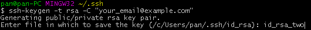

title: Hexo管理多个blog站点
date: 2016-01-25 16:04:44
categories:
- 实践笔记
tags:
- hexo
- ssh
- git
---

在使用Hexo博客框架是，可能存在同时管理多个站点的情况。本文记录如何使用Hexo同时向两个github账号上部署站点的情况，主要包括两个步骤：
> 1.设置ssh连接多个github账号
> 2.设置站点配置文件

本文的环境为windows 7

<!-- more -->

## 设置ssh连接多个github账号
ssh能以一种安全、加密的方式连接远程的计算机。连接github时需要设置ssh，并设置ssh-agent，这样就不必要每次都手动进行认证了。若您设置了全局的用户名和邮箱，在~/.gitconfig配置文件中可以查看。可能需要使用以下命令取消全局设置。

> git config --global --unset user.name
> git config --global --unset user.email

### ssh密钥生成
若在~/.ssh（这是linux用户目录的写法，本文为方便也这么写，实际目录在用户目录的.ssh文件夹下）已存在多个密钥文件，则忽略本步骤。否则，首先使用命令
> ssh-keygen -t rsa -C "your_email@example.com"

为每一个github账号都生成一个rsa秘钥，并将其公钥分别添加到相应的github账号下（具体步骤这里不展示）。

需要注意的是，在生成rsa密钥时，默认的生成id_rsa和id_rsa.pub两个文件。
> - 为避免密钥覆盖，需要为两份密钥命名。
> - 将工作路径设置到~/.ssh目录下，否则生成的密钥文件将在你当前的工作目录下

具体如图所示：


### 将密钥添加到ssh-agent
ssh-agent是一个后台程序，将密钥加载到内存中，这样我们就不需要每次都输入密码，当连接进行操作的时候。首先使用以下命令开启ssh-agent：
> eval`ssh-agent`

然后向ssh-agent中添加密钥，这里以id_rsa为例：
> ssh-add ~/.ssh/id_rsa

我们可以使用下面命令，查看添加了哪些密钥
> ssh-add -L


### 配置config文件
在~/.ssh目录配置config文件，windows默认情况下是没有该文件的，你需要自己新建一个或在某个.git目录下拷贝一个进行修改。具体配置如下：

```xml
# one
Host one.github.com
HostName github.com
User git
IdentityFile C:\Users\**\.ssh\id_rsa

# two
Host two.github.com  # 前缀名可以任意设置
HostName github.com
User git
IdentityFile C:\Users\**\.ssh\two_rsa
```

Host向github.com添加一个前缀，用来区分不同的账号，前缀可以任选，但都得对应到HostName为github.com。IdentityFile设置为相应账号的ssh连接密钥文件。

### 测试连接
分别测试连接到相应的Host能否成功：
> $ ssh -T git@one.github.com
> Hi one! You've successfully authenticated, but GitHub does not provide shell access.

> $ ssh -T git@two.github.com
> Hi two! You've successfully authenticated, but GitHub does not provide shell access.

若测试连接不同的账号返回不同的用户名，这里用one、two表示，则表示成功连接了两个不同的github账号。

## 站点配置
git的ssh形式的URL如下：
> git@github.com:username/repo_name.git

需要将博客部署到的github库，以ssh形式的URL给出。

### 修改站点配置文件
要实现Hexo管理多个博客站点到github，需要使用之前配置好的ssh连接。需要将_config.yml下的deploy的值修改如下

```
deploy:
  type: git
  repository: git@one.github.com:***/***.github.io.git
  branch: master
```

若设置好后还出现错误：
> ERROR Deployer not found: git

则查看是否还需要安装`hexo-deployer-git`
> npm install hexo-deployer-git --sive